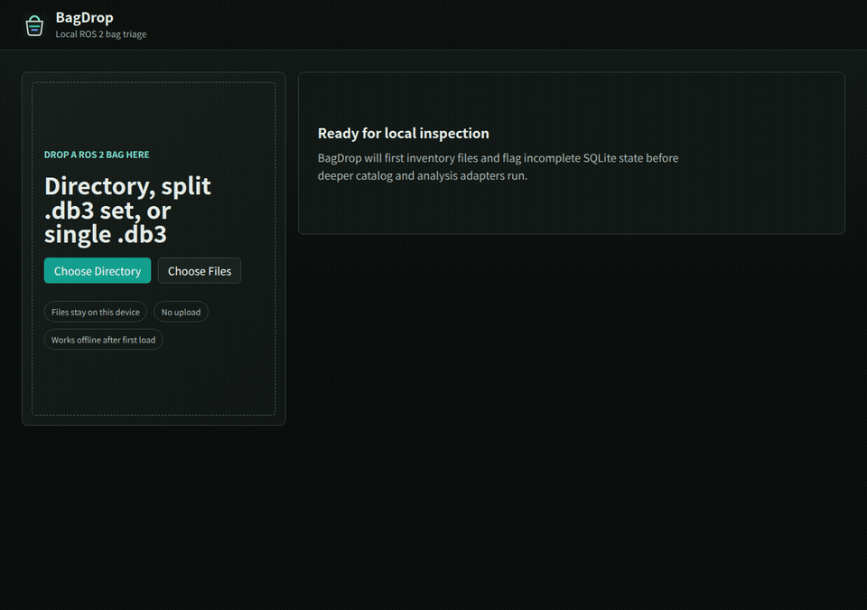
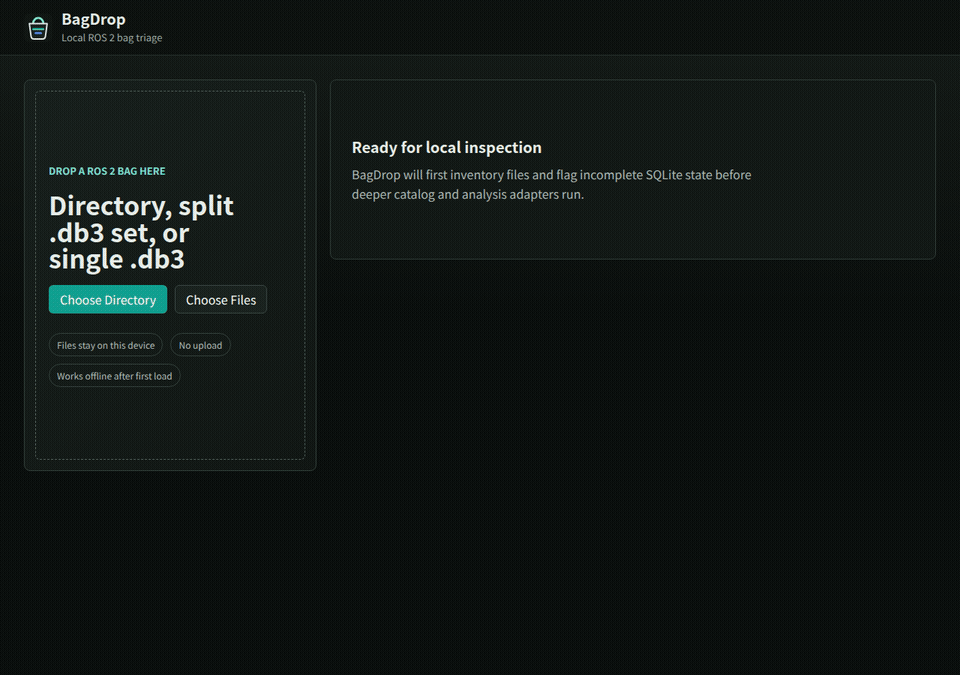
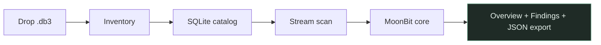

# BagDrop

BagDrop is a local-first ROS 2 bag diagnostic tool. It accepts a bag directory or `.db3` file in the browser, produces a fast overview, and runs targeted deterministic analysis without uploading bag data.

The bag Worker scans SQLite catalogs, streams topic timestamps in batches, and feeds them to the MoonBit analysis core. Official SQLite Wasm handles database access; MoonBit Wasm owns stream verification findings, topic statistics, and starter CDR validation.

**Live demo:** https://rsasaki0109.github.io/BagDrop/

Recorded UI flows (Playwright + ffmpeg):

| Demo | GIF |
| --- | --- |
| Clean bag → topic plots |  |
| Bag with findings → topic jump |  |

Regenerate with `pnpm --filter @bagdrop/web record:demo` (requires Playwright Chromium and ffmpeg).

## UI highlights

- **Topics filter** — search by topic name or message type; the table shows a `matched / total` count.
- **Findings panel** — grouped by category (`Stream`, `Diagnostics`, …) with severity pills, topic badges, and evidence rows. Click a topic badge to jump to that row and open its plot.
- **Topic plots** — tabs depend on message type: intervals for every topic; **Value** for scalar types and derived Imu/TwistStamped/LaserScan metrics; **Range** for LaserScan profiles; **XY trajectory** for pose, odometry, and path topics; **Lat/Lon** for NavSatFix.
- **CDR column** — per-topic decode success counts from MoonBit validation. See [docs/supported-types.md](docs/supported-types.md) for the full list of supported message types.

## Example Result

BagDrop turns a dropped rosbag2 SQLite segment into a local `ResultBundle` without uploading bytes.



### Clean bag

[`sample_rosbag.result.json`](tests/golden/sample_rosbag.result.json) — `demo_bag/segment_0.db3`

| | |
| --- | --- |
| **Overview** | 11 messages · 5 topics · `ready` · **0 findings** |
| **Bag health** | **Healthy · 100** |
| **Backend** | MoonBit `wasm` |

**Topics**

| Topic | Type | Count | Rate | Max gap | CDR | Status |
| --- | --- | ---: | --- | --- | --- | :---: |
| `/cmd_vel` | `geometry_msgs/msg/TwistStamped` | 2 | 2.5 Hz | 0.4 s | **2 ok** | ok |
| `/fix` | `sensor_msgs/msg/NavSatFix` | 1 | N/A | N/A | **1 ok** | ok |
| `/imu` | `sensor_msgs/msg/Imu` | 2 | 1.25 Hz | 0.8 s | **2 ok** | ok |
| `/odom` | `nav_msgs/msg/Odometry` | 3 | 1.5 Hz | 1 s | **3 ok** | ok |
| `/temperature` | `std_msgs/msg/Float64` | 3 | 1.5 Hz | 0.7 s | **3 ok** | ok |

**Findings panel**

```text
(no findings)
```

Both GNSS and odometry payloads decode successfully. This is the “all green” path.

The GIF above shows the same flow in the live UI: drop a `.db3`, filter topics, review **Healthy** bag health, then open `/odom`, `/temperature`, `/imu`, and `/cmd_vel` topic plots.

**Topic plots**

Select a topic row to open the plot panel below the Topics table. Use the filter box above the table to narrow topics by name or type. Available tabs depend on message type:

| Topic | Tabs |
| --- | --- |
| `/cmd_vel` | **Intervals** · Value (`linear.x`) |
| `/odom` | **Intervals** · XY trajectory |
| `/fix` | **Intervals** · Lat/Lon |
| `/imu` | **Intervals** · Value (`|linear acceleration|`) |
| `/temperature` | **Intervals** · Value |

```text
┌─ Topic Plot ─ /odom · 2 points ────────────────────────────────┐
│ [Intervals]  Value  XY trajectory  Lat/Lon                     │
│ Message interval Δt (seconds) vs bag time.                     │
│                                                                │
│     1.0s ┤              ●                                      │
│          │         ●                                           │
│     0.5s ┤    ●                                                │
│          └────────────────────────────────────────── bag time  │
└────────────────────────────────────────────────────────────────┘

┌─ Topic Plot ─ /temperature · 3 points ─────────────────────────┐
│ Intervals  [Value]  XY trajectory  Lat/Lon                     │
│ Decoded std_msgs/msg/Float64 values over bag time.             │
│                                                                │
│      44 ┤                              ●                       │
│      43 ┤                   ●                                  │
│      42 ┤          ●                                           │
│          └────────────────────────────────────────── bag time  │
└────────────────────────────────────────────────────────────────┘
```

### Bag with findings

[`sample_rosbag_with_findings.result.json`](tests/golden/sample_rosbag_with_findings.result.json) — `demo_bag/findings_segment_0.db3`

| | |
| --- | --- |
| **Overview** | 7 messages · 4 topics · `ready` · **4 findings** |
| **Bag health** | **Critical · 6** — mix of **Diagnostics** payload errors and **Stream** issues |
| **Summary** | `2 errors · 2 warnings` |

**Topics**

| Topic | Type | CDR | Status | Why |
| --- | --- | --- | :---: | --- |
| `/diagnostics` | `DiagnosticArray` | 1 ok | ok | ERROR status in payload → Diagnostics finding |
| `/fix` | `NavSatFix` | 1/2 ok | error | catalog says 5 msgs, stream found 2; 1 bad payload |
| `/odom` | `Odometry` | 2 ok | ok | baseline healthy topic |
| `/scan` | `LaserScan` | 2 ok | warning | 6 s gap between messages |

**Findings panel (as shown in the UI)**

```text
┌─ ERROR ─ Diagnostics ────────────────────────────────────────┐
│ Diagnostic errors reported                                   │
│ Topic /diagnostics decoded 1 ERROR-level diagnostic status   │
│ (e.g. cpu).                                                  │
│ /diagnostics · errors=1 · warnings=0 · stale=0 · ok=0        │
└──────────────────────────────────────────────────────────────┘

┌─ ERROR ─ Stream ─────────────────────────────────────────────┐
│ Stream count mismatch                                        │
│ Topic /fix streamed 2 messages, but catalog reported 5.      │
│ /fix · streamedCount=2 · catalogCount=5                      │
└──────────────────────────────────────────────────────────────┘

┌─ WARNING ─ Stream ───────────────────────────────────────────┐
│ CDR decode failures                                          │
│ Topic /fix had 1 payload that could not be decoded.          │
│ /fix · decodedPayloads=1 · decodeErrors=1                    │
└──────────────────────────────────────────────────────────────┘

┌─ WARNING ─ Stream ───────────────────────────────────────────┐
│ Large timestamp gap                                          │
│ Topic /scan has a maximum inter-message gap of 6 s.          │
│ /scan · maxGapNs=6000000000                                  │
└──────────────────────────────────────────────────────────────┘
```

Try it live: drop a bag at https://rsasaki0109.github.io/BagDrop/ — findings appear in the right-hand panel with severity pills, topic badges, and evidence rows. Diagnostic arrays on `/diagnostics` topics produce **Diagnostics** findings when ERROR or WARN statuses are decoded.

The findings GIF uses the same synthetic `.db3` shape as the golden export. Live scans surface CDR decode failures, diagnostic statuses, and large timestamp gaps; the golden JSON also includes a deliberate stream count mismatch for documentation.

### Regenerate golden exports

```bash
UPDATE_GOLDEN=1 pnpm --filter @bagdrop/web exec vitest run tests/export_golden_result.test.ts
```

## Development

```bash
pnpm install
pnpm dev
```

Build the MoonBit core Wasm module (requires the [MoonBit CLI](https://www.moonbitlang.com/download)):

```bash
pnpm build:moon-core
```

The app is served from `apps/web` and is configured for GitHub Project Pages with `base: "/BagDrop/"` (must match the repository name).

## Architecture Direction

- TypeScript owns browser APIs, drag and drop, Worker lifecycle, rendering, PWA, and local exports.
- Official SQLite Wasm owns SQLite parsing, B-tree access, schema probing, and database integrity behavior.
- MoonBit Wasm owns streaming statistics, stream verification findings, starter CDR validation, and (later) diagnostics and plugin contracts.
- Bag data stays on the user's device. The app must not send raw bag bytes, decoded messages, derived statistics, or generated reports to the network.

See [docs/architecture/overview.md](docs/architecture/overview.md) and [docs/privacy.md](docs/privacy.md).
